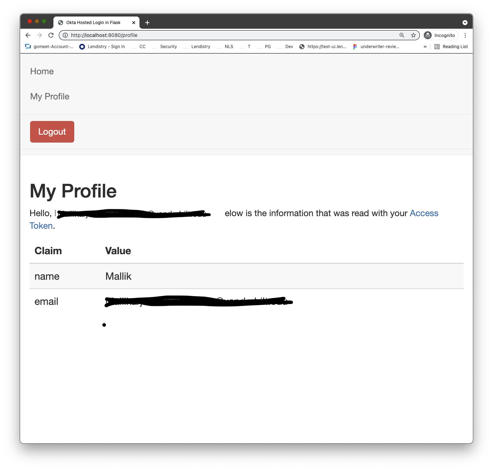

# Flask + Okta Hosted Login Example
This example shows you how to use Flask to login to your application with an Okta Hosted Login page.  The login is achieved through the [authorization code flow](https://developer.okta.com/authentication-guide/implementing-authentication/auth-code), where the user is redirected to the Okta-Hosted login page.  After the user authenticates they are redirected back to the application with an access code that is then exchanged for an access token.

> Requires Python version 3.6.0 or higher.

## Prerequisites

Before running this sample, you will need the following:

* An Okta Developer Account, you can sign up for one at https://developer.okta.com/signup/.
* An Okta Application, configured for Web mode. This is done from the Okta Developer Console and you can find instructions [here][OIDC WEB Setup Instructions].  When following the wizard, use the default properties.  They are are designed to work with our sample applications.

## Running This Example

To run this application, you first need to clone this repo:

Then install dependencies:

```bash
pip3 install -r requirements.txt
```

You also need to gather the following information from the Okta Developer Console:

- **Client ID** and **Client Secret** - These can be found on the "General" tab of the Web application that you created earlier in the Okta Developer Console.
- **Issuer** - This is the URL of the authorization server that will perform authentication.  All Developer Accounts have a "default" authorization server.  The issuer is a combination of your Org URL (found in the upper right of the console home page) and `/oauth2/default`. For example, `https://dev-1234.oktapreview.com/oauth2/default`.

Copy the [`client_secrets.json.dist`](client_secrets.json.dist) to `client_secrets.json` and fill in the information you gathered.

```json
{
  "auth_uri": "https://{yourOktaDomain}/oauth2/default/v1/authorize",
  "client_id": "{yourClientId}",
  "client_secret": "{yourClientSecret}",
  "redirect_uri": "http://localhost:8080/authorization-code/callback",
  "issuer": "https://{yourOktaDomain}/oauth2/default",
  "token_uri": "https://{yourOktaDomain}/oauth2/default/v1/token",
  "token_introspection_uri": "https://{yourOktaDomain}/oauth2/default/v1/introspect",
  "userinfo_uri": "https://{yourOktaDomain}/oauth2/default/v1/userinfo"
}
```

Now start the app server:

```
python main.py
```

Now navigate to http://localhost:8080 in your browser.

If you see a home page that prompts you to login, then things are working!  Clicking the **Log in** button will redirect you to the Okta hosted sign-in page.

You can login with the same account that you created when signing up for your Developer Org, or you can use a known username and password from your Okta Directory.

**Note:** If you are currently using your Developer Console, you already have a Single Sign-On (SSO) session for your Org.  You will be automatically logged into your application as the same user that is using the Developer Console.  You may want to use an incognito tab to test the flow from a blank slate.

[OIDC Web Setup Instructions]: https://developer.okta.com/authentication-guide/implementing-authentication/auth-code#1-setting-up-your-application

Screenshots of the Oauth login flow:


Okta Login Page:


Logged in Page:

